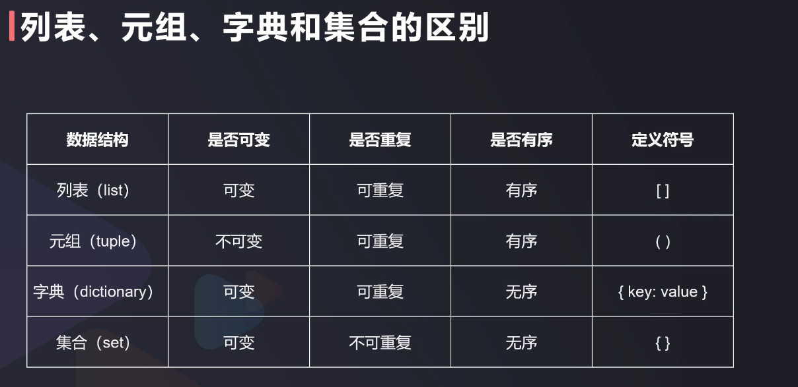

# 基础语法
1. 变量命名规则
* 构成：字母，数字，下划线
* 非关键字，非空格
```python
>>> var="Python程序设计"
>>> print(var)
Python程序设计
>>> 
>>> a=3
>>> b=5
>>> print(a+b)
8
```

2. 数据类型
* int
* float
* str
* bool
```python
type(123)
type(3.14)
type("abc")
type(False)
print(4+6,'4'+'6')
```

3. 字符串
* 单引号/双引号
* 转义字符
```python
s1="arya's a little girl"
s2='arya\'s a little girl'
s3='arya \
is a little girl'
s4='arya\nis a little girl'
s5='arya\t is a little girl'
s6="""arya
is a little girl"""
```
* 长度/切片  
string[start:end:steps] --> [start,end)
```python
s='0123456789'
print(len(s))

print( s[3] )  # start from index=0
print( s[3:5] )  # end not be contain
print( s[3:9:3] )
print( s[:3] ) # [0,3)
print( s[6:] ) # [6,len)

ss="Python非常有趣"
print( ss[:6] )
print( ss[6:] )
```
*   

4. 运算符
* 算术运算符
* 赋值运算符
* 比较/关系运算符
* 逻辑运算符
* 类型转换
```python
print( 2+3 , 2-3 , 2*3 , 2/3 , 2%3 , 2//3 )
print( 2**3 )

a=4
b=a

b+=a
b*=a

b == a
b != a 

print( '3'+'4' , int('3')+int('4') , float('3')+float ('4')  )

a='圆周率='
b='3.14'
print( a+str(b) )
print( a+repr(b) )

```

5. 输入与输出

```python
print("圆周率是{}嘛？".format(3.14))

p=input("请输入: ")  # type=str
print('输入的是',p)

```


# 数据结构
1. 列表
* 定义
* 访问：单个元素/切片/负数索引
* 添加
* 删除
```python
a=[]
b=[0,1,2,3,4,"abc"]

print( b[3] ,b[-1] ) 
b[0]=123
print( b )

# list[start,end,steps] --> [start,end)  --> just like str
print( b[3], b[3:] ,b[:3] )
print( b[3:-1] )
print( b[1::2])

b.append(666)
print(b)

del b[-1]
print(b)

```

2. 元组
* 创建：基本语法/与列表的区别/注意单个值情况
* 访问：索引访问/切片访问/注意不能修改值
* 操作：删除/连接/计算长度函数/迭代方法
```python
a=(0,1,2,3,4,5,6,7,8,9,'abc')
b=(5)
c=(5,)
print( type(b) ,type(c) )

print( a[0],a[5],a[-1] )
print( a[5:] , a[5:-1:2] )
# a[0]=123  # TypeError: 'tuple' object does not support item assignment
# del a[-1] # TypeError: 'tuple' object does not support item assignment
del a

a=(1,2,3)
b=(0,)
c= b+a
print(c)
print(len(c) )
print ( b*3 )

```

3. 字典
* 定义
* 引用
* 增加
* 删除
```python
a={ 'a':1,'b':2,'c':3 } 
print( a["a"] )
a["a"]=111
print( a["a"] )

a["d"]=4
print(a)

del a['a']
print(a)

```

4. 集合
* 定义
* 添加
* 删除: 删集合/随机删一个元素/删除指定元素/删除全部元素
* 运算：交集/并集/差集

```python 
myList=['abc','xyz','orz','orz']
myTuple=('abc','xyz','orz','orz')
myDict={'abc':111,'xyz':222,'orz':333}
mySet={'abc','xyz','orz'}

type( set(myList) )    
type( set(myTuple) )
# will de-deup auto while you cast list/tuple to set
my=set(myList)

mySet.add('opq')
print(mySet)

mySet.pop() #随机删一个
mySet.remove('abc')
mySet.clear() #删除全部元素
del mySet #删除整个集合

#交集
mySet & my
#并集
mySet | my
#差集
mySet - my
my - mySet

```

5. summary


# 分支结构
1. 单分支
2. 双分支
3. 多分支
4. 内联if
5. 条件语句
```python
if 5 > 5:
    print(123)

num=input()
if int(num)>0:
    print('正数')
else:
    print('负数')

if int(num)>0:
    print('正数')
elif int(num)=0:
    print('0')
else:
    print('负数')

# a1 if confition else a2
a=5
b=9
c= a if a>b else b
print(c)

# if con dition can be 比较运算 or 逻辑运算( and/or/not )

```
 
# 循环 
1. for in
2. while
3. break
4. continue
```python

myStr="abcdefg"
myList=['abc','xyz','orz','orz']
myTuple=('abc','xyz','orz','orz')
myDict={'abc':111,'xyz':222,'orz':333}
mySet={'abc','xyz','orz'}

for s in myStr:
    print(s, end='-')

for i,j in enumerate(myList):
    print(i,':',j)

for i,j in enumerate(myTuple):
    print(i,'->',j)

for item in myDict.items():
    print( type(item) , '//' ,item)
for k,v in  myDict.items():
    print(k,v)
for k in myDict.keys():
    print( type(k) , '//' ,k,'-->',myDict[k] ) 
for v in myDict.values():
    print( type(v) , '//' ,v)

# range(start,end,steps)
for i in range(13,31,3):  
    print(i)

a=range(5) # is a object: <class 'range'>
print( a,type(a) )
b=list(a)
print(b)


i=0
while i<5:
    print(i)
    i += 1

name=""
while not name:
    name=input("please input your name and name cannot be null: ")

print(name)

x=[1,2,3,4,5,6,7,8,9,0]
while len(x) >0:
    a=x.pop()
    if a%2 ==0:
        continue
    print(a)
    if a==7:
        break

```


# 函数
1. 概念
2. 内置函数
!(sum)[./20220416-ref2.png]
```python
x=[111,123,222,321,51,13]
print( max(x), min(x), sum(x) )

print( pow(2,3) , 2**3 , 3**2 )
print( abs(-13) )

y=sorted(x)
z=sorted(x,reverse=True)
print(z,'\n',y,'\n',x)

x=[1,2,3]
y=[3,2,1]
xy=zip(x,y)
xyl=list(xy)
print( xyl, type(xyl[0]) )

# all() 用于判断给定的可迭代参数 iterable 中的所有元素是否为True，如果是则True 否则False
# 元素为True，代表 元素不为 0/空/None/False 
print( all( [0,1,2,3] ) )
print( all( [1,2,3] ) )
print( all( [1,2,3 ,None ] ) )
print( all( [1,2,3 ,False ] ) )
print( all( [1,2,3 ,'' ] ) )
# any() 判断元素 有一个为真 则 True
print( any( [ None,False,'',0 ] ) )
print( any( [ None,False,'',0 ,1] ) )

# 特别注意 集合本身为空的情况
print( all( [] ) )  # True
print( any( [] ) )  # False

```

3. 自定义函数
def 函数名(参数):
    函数体
    [return 返回值]
```python
def area(r):
    return 3.14*r*r

area(9)
```

4. 函数进阶

```python
# 局部函数 ： 在函数里面再定义函数
def comp(type,n):
    def double(n):
        return n*2
    def half(n):
        return n/2 
    def sqr(n):
        return n*n
    
    if type=='double':
        return double(n)
    elif type=='half':
        return half(n)
    elif type=='sqr':
        return sqr(n)
    else:
        print("not contain this type and return zero")
        return 0

comp("double",3)


# 匿名函数：
def comp1(type):
    if type=='double':
        return lambda n:n*2
    elif type=='half':
        return lambda n:n/2
    elif type=='sqr':
        return lambda n:n*n
    else:
        print("not contain this type and return zero")
        return 0


fun=comp1('sqr')
fun(9)

```

5. 作用域
```python
msg='1111111'
print(msg)
def show():
    # global msg
    msg='2222222'
    print(msg)
show()
print(msg)


```

# 模块与包
# 高级语法
# 面向对象
# 文件操作
# 数据库基础
# 错误处理
# 总结
